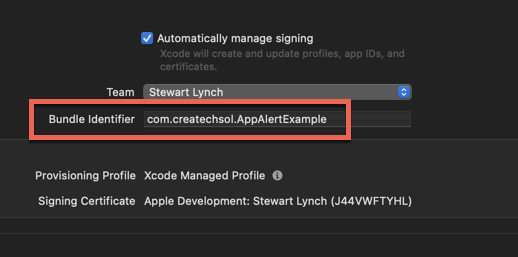
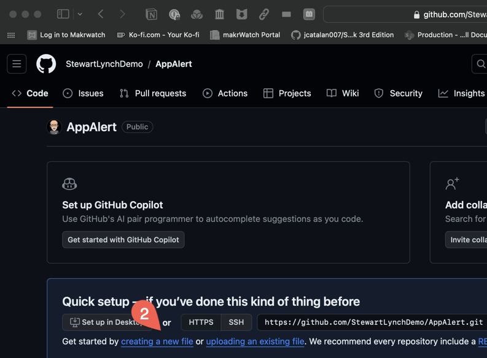
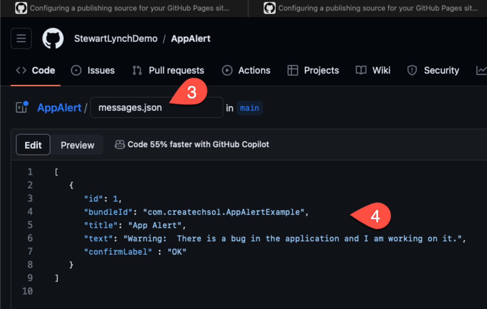
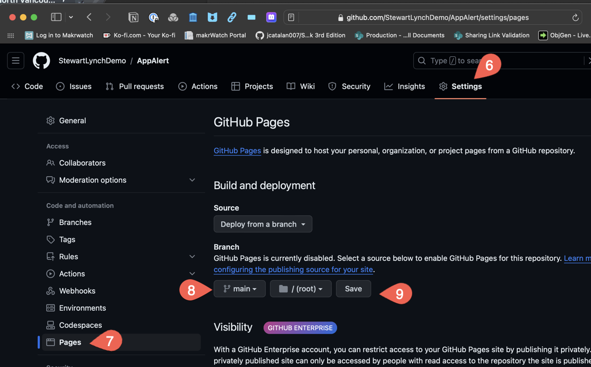

# Dynamic Application Message Alerts

There may be times that you have an urgent need to alert users of your apps and you need to do this without having to wait for an AppStore update.

Perhaps a recent OS update is causing an issue with some functionality in your app and you need a little time to work on it.  You are getting bad reviews or support emails are getting out of control. 

Wouldn't it be nice if you could somehow get the word out to the users that you are working on it and that a fix will come soon.

Maybe you need to provide them with a link to some site that will show them a temporary workaround.

Well that is what this video is all about.  I need to find a way to present an in app alert to all of my users at any time without pushing out a new version.

I am going to accomplish this by storing a small json object in a specific location on one of my GitHub repositories so that I can update it at will and then have my app fetch and decode it.

I will perform a check in my app to see if it has already seen that information and if not, present an alert using the information decoded from the fetched json object.

## Create a Sample App

The first, create a sample application to test out the solution.  Each application will have a unique Bundle ID  and you can use that to make sure that you are grabbing the correct json object from the array that you will be decoding.  You can use the same json payload for all of your applications with each object in the array being a potential message  for one of your apps.  You'll be able to know which one you want by the app's Bundle ID.

1. You can call the app anything you want. For example **AppAlertExample**
2. Once the app has been created, make note of or copy the *Bundle Identifier*
   1. In my case it is `com.createchsol.AppAlertExample`
   
   

## GitHub Pages

GitHub Pages is a static site hosting service that takes HTML, CSS, and JavaScript files straight from a repository on GitHub and publishes a website.

GitHub Pages is available in public repositories with GitHub Free and in public **and** private repositories with GitHub Pro so there is no cost to you to do this if you want to use a public repository.

The only requirement is that you have a GitHub account.  Since it is now free for unlimited public and private repositories, there is no financial barrier.

You can find out more about GitHub Pages at this link

https://docs.github.com/en/pages/getting-started-with-github-pages/configuring-a-publishing-source-for-your-github-pages-site

Let's step through the process of creating a repository that will act as our GitHub pages source.

First, log in to your GitHub account.

1. Once you have your account, and are logged in, create a new repository and call it AppAlert.  

      

2. You can create a new file from the resulting page once the repository has been created by clicking on the  *<u>Get started by creating a new file</u>* link.

      

3. It is in this file that we want to create a JSON object that will allow us to decode in our app so call the file  **messages.json**.

4. For body of the file,  you can add an array of  json object that will represent the information that you want use to present an alert in your applications when necessary.

   1. Start with an empty array and within the array, create a json object for every one of the apps that you want to use to deploy this solution to.

   So, for this sample app, create a json object with 5 key-value pairs.

   1. The first key will be `id` and it will be an Int representing the message number.  Set the value to  1 indicating this will be the first message ever presented in the app.
   2. Next, the key will be for `bundleId` and the value will be the value for the app's Bundle ID.
      1. You can paste in as a string, that Bundle ID from your demo application.
   3. Next, create a `title` key that will represent the tile to be used on an alert.  For the value, provide an appropriate string.
   4. Follow this with a `text` key to represent the message text in an alert  and then the value, again, provide an appropriate string.
   5. For the final key, use `confirmLabel` and provide the string that you want use for the dismiss or confirmation button label on the alert.

```swift
[
   {
      "id": 1,
      "bundleId": "com.createchsol.AppAlertExample",
      "title": "App Alert",
      "text": "Warning:  There is a bug in the application and I am working on it.",
      "confirmLabel" : "OK"
   }
]
```



Make sure you **Commit** and save this update.  You can use the default message provided for the commit.

5. When you do that, you will be presented with this error alert.  Do not worry about it.  Just go to the default branch, which is **main**
   

Next, you need to set up the **Pages** component of this repository so that it will provide your json object upon a fetch request from your app. 

6. Click on Click on the **Settings** tab at the top.

7. Click on **Pages** in the sidebar.

8. Choose the **main** branch.
9. Click on **Save**.



It will take a short time to deploy, but fairly shortly, if you keep refreshing the browser, you will see it the notification on this page providing you with a link to the root of your new pages website.


10. You will see the link at the top.

```swift
Your site is live at https://stewartlynchdemo.github.io/AppAlert/
```

This is the link to the Root folder, since you called the file **messages.json** the link to that file will be.

```swift
https://stewartlynchdemo.github.io/AppAlert/messages.json
```

11. If you copy that url into a browser search/navigation field and press **Enter**, you will see the JSON Returned.


This is exactly what you need to fetch from your application and then decode it into an array of messages and find the one that will correspond to your application's Bundle ID.

## Creating the Message Service

Now, it is up to you to create a generic **AlertService** that you can use in all of your apps including the demo one.

To make this a drop-in reusable service, or potentially create a Swift Package for this, you can create a class using the *Observation* framework introduced in iOS 17 to monitor changes

1. In your project create a new Swift file and call it **AlertService**.
1. In that file, create a class using that file name and apply the `@Observable` macro to it.

```swift
@Observable
class AlertService {
  
}
```

2. Within the class, create a struct that will model your json object.  
   1. Call it **Message** and have it conform to the **Codable** protocol.
   2. The struct will need 5 properties where the property names match the keys the json object created on the GitHub pages, *messages.json* array.
   3. All values will be Strings except for the id property which is an Int.
   4. Since you will only display this message when you received some valid JSON in the fetch and update it with the fetched values, you can provide default values for each here to make it easier to create an initial instance of this struct in step 4 below. Use empty strings for the String properties and 0 for the id.


```swift
struct Message: Codable {
    var id: Int = 0
    var bundleId: String = ""
    var title: String = ""
    var text: String = ""
    var confirmLabel: String = ""
}
```

3. Next, create the class properties.
   1. The first one will be called `jsonURL` and it will be a String.  We will pass in the string for the url when the class is initialized.  This is the url that points to the **messages.json**.
   2. The second is a convenience property called `bundleIdentifier` that will be a String representing the applications Bundle Identifier.  It can be initialized using `Bundle.main.bundleIdentifier` and you will need to force unwrap it. 

```swift
let jsonURL: String
let bundleIdentifier =  Bundle.main.bundleIdentifier!
```

4. You will need an instance of the message struct and that will be updated with values from the decoded JSON.

```swift
var message = Message()
```

5. You will only be presenting the alert if it is necessary, and in that case, your view will need to be monitoring some Boolean property so that if it changes to true, the alert can be presented.  So, create a boolean property called `showMessage` and initialize it as false.

```swift
var showMessage = false
```

5. Every time the app runs, you will want to be able to fetch and decode the json, find the object corresponding to the application's Bundle ID, and then compare the id to one that one you will have persisted in your application somewhere.  If that id is greater than the one stored, then you will present the message as an alert and update the id so that it does not present again next time the application launches.
6. AppStorage is a good place to store this, but since you are not in a SwiftUI view, you cannot use it here. You will have to resort to using **UserDefaults**.
   1. Create property called  `lastMessageId` as an Int and provide a getter and a setter for this property. 
   2. For the *get* , use the **UserDefaults.standard.integer** forKey and specify `lastMessageId`. 
      The first time it seeks this, it will not find it, so it will default to 0.  This means if your json object that is fetched is greater than 0,  you should display the alert using the message information in that json object.
   3. For the *set*, you can again use **UserDefaults.standard.setValue** and provide the `newValue` for that same key that was used in the getter.


```swift
var lastMessageId: Int {
    get {
        UserDefaults.standard.integer(forKey: "lastMessageId")
    }
    set {
        UserDefaults.standard.setValue(newValue, forKey: "lastMessageId")
    }
}
```

7. With all of the properties created, the `jsonURL` string is the only one that has not been initialized so you need to create an initializer for this.

```swift
init(_ jsonURL: String) {
    self.jsonURL = jsonURL
}
```

7. Now,  create the async function that will fetch the Json, decode it, find the first one matching the app's Bundle ID and update the observed message object.

   1. Call the function `fetchMessage` and using modern concurrency methods, specify that it is asynchronous.

   ```swift
   func fetchMessage() async {
     
   }
   ```

   1. Within the body, create a `do....catch` block.

      1. In the do, fetch the data from the url by trying to await the result of calling `URLSession.shared.data` from the URL formed by the static url and this will have to be unwrapped.

      ```swift
      let (data, _) = try  await URLSession.shared.data(from: URL(string: jsonURL)!)
      ```

      2. Next, let message be the result of trying to use the JSONDecoder to decode from the array of *Message* type from that data

      3. Now this will provide an array, so find the first one where the iterators bundleID is equal to the bundleIdentifier.

      4. This however will be an optional value so use an `if let` to unwrap it to a single message.

      6. Then, if that is the case, update the `self.message` to that `message` that has been decoded.

      7. If an error is thrown during fetching or decoding, the catch block is executed.  During testing, make sure you have a proper JSON array and a `Message` struct that can successfully decode from that array. The user will not get an alert if this fails so just print out a string to the console that you can use for debugging purposes.

```swift
func fetchMessage() async {
    do {
        let (data, _) = try  await URLSession.shared.data(from: URL(string: url)!)
        if let message = try JSONDecoder().decode(
            [Message].self,
            from: data
        ).first(where: {
            $0.bundleId == bundleIdentifier
        }) {
            self.message = message
        }
    } catch {
        print("Could not decode")
    }
}
```

8. To present an alert, you are going to have to toggle some state property in one of the app's views.  Preferably, the first view presented, so in the case of this sample application, it will be in `ContentView`.

   1. To do this, create a function called  `showAlertIfNecessary` and within this function you can call the `fetchMessage` function so it needs to be asynchronous too.

   ```swift
   func showAlertIfNecessary() async {
     
   }
   ```

   2. In the body, await the call to fetchMessage and if successful, the message object will either have been updated, or the fetch or decoding would have failed and thrown an error so you will have printed the error to the console and the user is none the wiser.

   3. If successfully decoded, check to see if the `message.id ` is greater than the `lastMessageId`

   4. If it is, *toggle* `showMessage`

   5. Finally set the `lastMessageId` to this `message.id`

   ```swift
   await fetchMessage()
   if message.id > lastMessageId {
       showMessage.toggle()
   }
   lastMessageId = message.id
   ```

9. That is it,  Now all you have to do is to initialize an instance of the AlertService in`ContentView` and pass in the url to the json payload.

10. When the view appears, you can create a task and await the result of calling the alertService's `showAlertIfNecessary` function.

11. If this results in the observed `showMessage` property being toggled, you can present an alert using the values obtained from the updated `message` object.

### Presenting the Alert

1. In *ContentView* for the sample app, create a new **State** property initializing the AlertService and pass in the url to the json.

```swift
@State private var alertService = AlertService("https://stewartlynchdemo.github.io/AppAlert/messages.json")
```

2. When the view appears,  use a **task** instead of  **onAppear** as the call to the `showAlertIfNecessary` function needs to be asynchronous.
3. In the body *await* the result of the `alertService.showAlertIfNecessary()` function.
   This will either toggle the state property or not depending on whether or not the condition has been met, i.e; the stored fetched `message.id` has to be greater than the stored `lastMessageId`.

```swift
.task {
    await alertService.showAlertIfNecessary()
}
```

3. Then, attached to one of the views, create an alert that will be presented based on the status of that state property.
   1. The `titleKey` will be the `alertService.message.title` property.
   2. `isPresented` is bound to `$alertService.showMessage`.
   3. The first closure allows you to create action buttons.
      1. Create a button with the label provided by  `alertService.message.confirmLabel` but leave the action empty.  This will simply provide a way to dismiss the alert.

   4. The message closure will be a text view displaying the `alertService.message.text`.


That is it done.


```swift
.alert(
    alertService.message.title,
    isPresented: $alertService.showMessage) {
        Button(alertService.message.confirmLabel) {}
    } message: {
        Text(alertService.message.text)
    }
```

4. If you run the application, since your initial *lastMessageId* will be **0** and the fetched id is **1**, this will set *showMessage* to **true** and trigger the presentation of the alert.
5. This will also update the *lastMessageId* to that value.
6. If you run the app again a second time, you will find that the alert is not presented.

Let's pretend now that you have another issue that we need to alert your users to but you want to do more than what you have already.  You would like to provide an option for your users to click on a link that can go to some external web site.

#### Update the Message struct

First then, you will need to create a new property in the message struct.

1. This property itself will include the link as well as the label for the link button, so within the *Message* struct, create a new struct called **Link** that conforms to the **Codable** protocol
2. Then create two properties, one for `title` and one for `url`, both Strings.

```swift
struct Link: Codable {
    let title: String
    let url: String
}
```

3. As you may not want to include this link every time we present an alert, you can make it optional as an additional property for our Message struct.  This will mean that the existing *messages.json* is still valid for your current message instance.

```swift
var link: Link?
```

### ViewModifier

There is something that I do not like particularly in this implementation so far.  If you look at the code for contentView, that alert will always be the same for every app, so why not bring that code into your AlertService as a **ViewModifier**.

1. Cut out the *Alert* code and return to the **AlertService** file.
2. **Import SwiftUI** as you will need it to create a view modifier.
3. Inside the AlertService class, create a view modifier called **AlertModifier** that conforms to **ViewModifier**
   1. This will have one requirement, a body function that has *content* as a parameter and returns *some view* 
   1. You can use that content then to apply an alert to.

```swift
 struct AlertModifier: ViewModifier {
   func body(content: Content) -> some View {
     content
   }
 }
```

3. You can paste in the alert that you copied from contentView as the modifier for *content*
   1. This will complain because there is no **alertService**, so we will need to pass that in when we call the modifier.
   1. So create a new property called **alertService** that is of type Alert Service** and it will have to be a **Bindable** object.

```swift
struct AlertModifier: ViewModifier {
    @Bindable var alertService: AlertService
    func body(content: Content) -> some View {
        content
            .alert(
                alertService.message.title,
                isPresented: $alertService.showMessage) {
                    Button(alertService.message.confirmLabel) {}
                } message: {
                    Text(alertService.message.text)
                }
    }
}
```

4. Next, since you added that **Link** property, you can check to see if was made available to you when you fetched and decoded the JSON.

   1. After the Button,  use an `if let` to unwrap it and then create a **Link** button using the `link.title` as the label and the `link.url` to form a URL with that string for the destination url.  And it has to be unwrapped.

   ```swift
   if let link = alertService.message.link {
       Link(link.title, destination: URL(string: link.url)!)
   }
   ```

5. Then one final thing to make this even better.  Create an extension for View

```swift
extension View {
  
}
```

6. And then within the extension, create a function called **messageAlert** that has a single parameter that is an *AlertService*'.

   1. In the body, apply the modifier function, passing in the `AlertService.AlertModifier`, providing  *alertService* as the argument.

   ```swift
   extension View {
       func messageAlert(_ alertService: AlertService) -> some View {
           modifier(AlertService.AlertModifier(alertService: alertService))
       }
   }
   ```

7. Finally then, return to **ContentView**, where you removed the alert and apply this new modifier.

```swift
.messageAlert(alertService)
```

### Update JSON Object

1. Return to the **GitHub pages** repository and open the **messages.json** file for editing.

   1. Increment the id.
   2. Change the title and text to something appropriate.
   3. This time provide a new object for the Link. (Make sure you add a comma after the confirmLabel key value pair).
   4. The link object will have two key value pairs; one for the title and one for the url.

   ```swift
   "link":{
      "title":"More information",
      "url":"https://www.createchsol.com"
   }
   ```

   5. Commit and save the changes.

   ```swift
   [
      {
         "id":2,
         "bundleId":"com.createchsol.AppAlertExample",
         "title":"App Alert",
         "text":"Warning:  There is a bug in the application and I am working on it.",
         "confirmLabel":"OK",
         "link":{
            "title":"More information",
            "url":"https://www.createchsol.com"
         }
      }
   ]
   ```

2. It will take up to 30 seconds for GitHub to clear its cache and update the site.  You can enter that url `https://stewartlynchdemo.github.io/AppAlert/messages.json` and keep refreshing the page, waiting for it to have been updated.

### Test

1. Return to your app now and run.  

   This time, because the fetched message has found an id that is greater than the one stored in the UserDefaults, the alert is presented.

   Also, because this message had a Link object, that link button is also presented, and tapping on it will take you to the specified web site.

## Potential Issues

It may be the case as you are testing your app and updating the json on your GitHub page, that when you return and run your app, the alert is not presented.  Why would this be the case?

It turns out that your app is caching the html content.  Eventually, the cache will get purged and if you wait long enough it will.  This will not really be an issue for your users, because it does get cleared fairly quickly, but if you are impatient during testing and would like to clear that cache immediately for testing purposes, you can do that

1. You just need to know where to look for that cache, and as another thought, perhaps, you just want to update the stored *lastMessageId*.  Where is that information persisted?
2. Add two static properties to your *AlertService*
   1. Name the first, `cacheLocation` and it will be the static property `URL.cachesDirectory`
   2. The second is the `userDefaultsLocation` which is also a static static property for `URL.libraryDirectory` by appending the path `Preferences`

```swift
static let cacheLocation = URL.cachesDirectory
static let userDefaultsLocation = URL.libraryDirectory.appending(path: "Preferences")
```

5. Now, when the app launches you can print the **path** location for easy copying and locating in finder.

```swift
.onAppear {
    print(AlertService.cacheLocation.path())
    print(AlertService.userDefaultsLocation.path())
}
```

6.  When you run the app, you will find the two urls printed to the console.

### Clearing the cache.

If you are not getting an alert and you expect one, it could be that the cache has not been purged, so you can *right click* on the caches path in the console and choose **Open** from the **services** menu to run the service and open the finder window showing the cache.  To clear the cache, just delete it and run again.

### Updating the lastMessageId

If I want to test the app out again, you can either go back and update that JSON object by providing a higher `id` value, or you can change the value stored in UserDefaults so that it is less than the value in your message id.

If you do not update the JSON, but still want to verify that all is well, you can either delete the current userDefaults and run again.  However, you may have other values persisted in UserDefaults unrelated to this alert so deleting it may not be a great idea.  What you can do, is update that single value by setting it back to some value lower than the id in the message json for this application.

It turns out that this is just a file in the preferences folder your my app and use that link to go there in the same way that you opened the cache location

1. You can double click on this file and open it in Xcode.  You will find that the id has a value which is the same as the id in the jSON object.
2. Change this value to any number less than that.
3. When you run again, the alert pops up.

I hope that you have found this tutorial helpful and that you can see uses for this technique in your own projects.

I am sure you can get creative with the JSON payload so that you can provide much more information and instead of presenting an alert, present a modal sheet instead.

One thing you might consider is to create another static property that will provide the OS version and another for the version number of your application.  Then in the JSON file create string keys for these and if necessary, provide os values and build numbers that might trigger a specific action in your application based on a comparison like you did with the id.

It is all up to your own imagination here.  It is very powerful.

